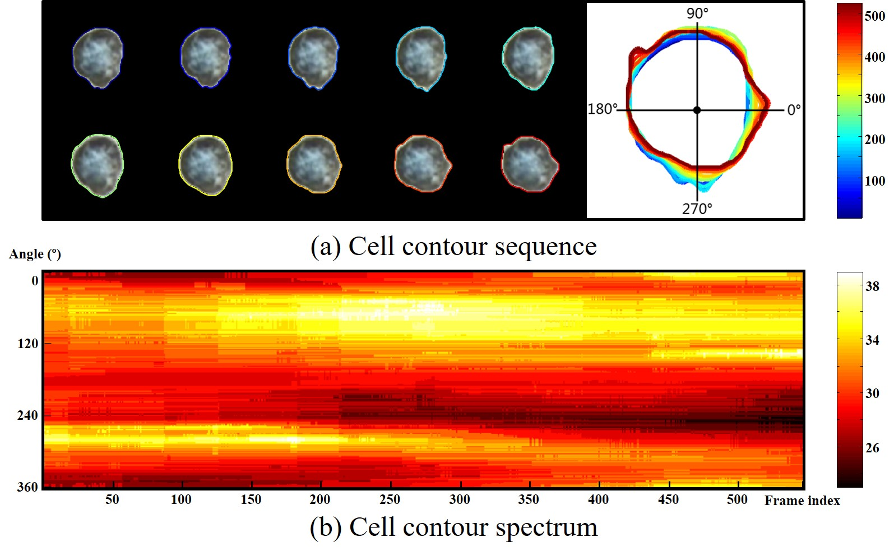
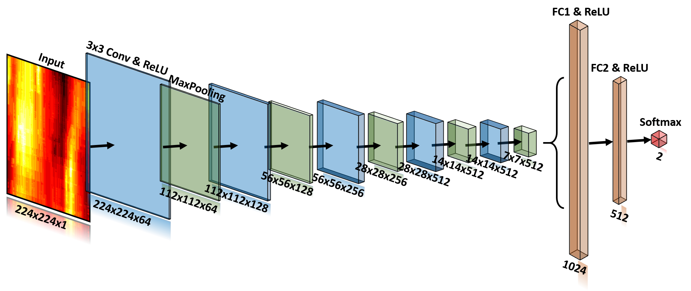
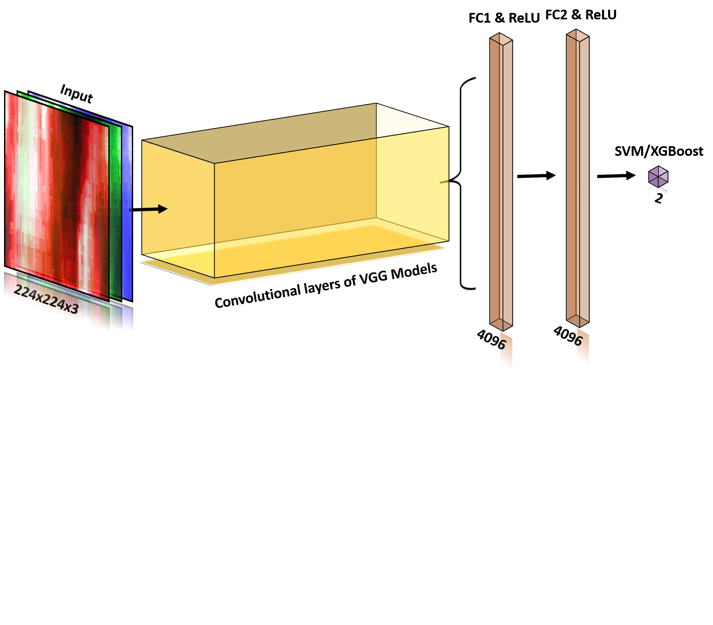
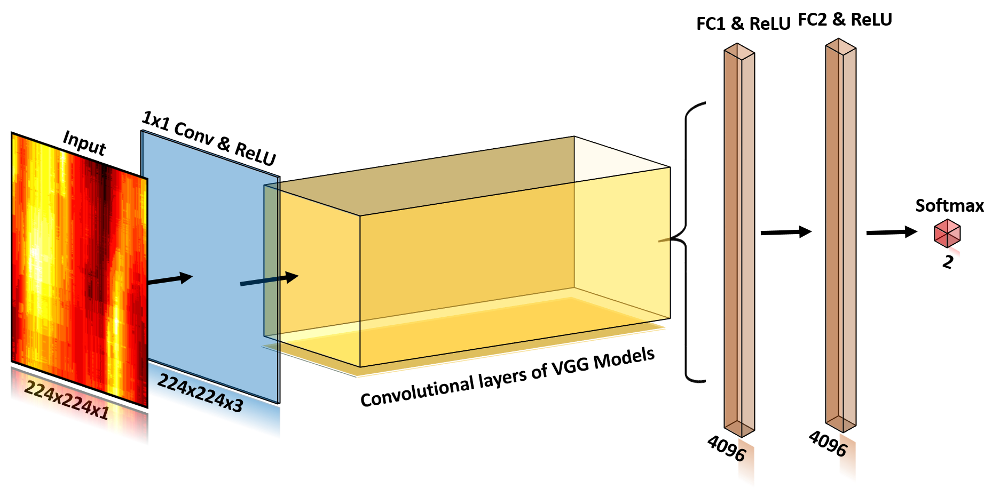

# Deep-learning-models
These files is to perform deep learning models on cell classification. The packages of Keras, Tensorflow, os, xgboost and sklearn are necessary to use the code.
Please uncompress the file of ExampleDataset.rar, and put the output ExampleDataset.npz in the same folder of the .py files.

## Example data
ExampleDataset.rar is the compressed file of ExampleDataset.npz, which contains 30 cell sequences for binary classification. For a cell video, it is represented by the contour sequence and then is zoomed to size of 224x224. Augmentation is performed to generate 216 data subjects from one sequence. Therefore the shape of the example dataset is 30x216x224x224.

  
<b>Figure 1: </b> Cell sequence to contour spectrum.  

## Deep learning frameworks
1. ScratchModel.py trains a CNN model from scratch for cell classification.

  

<b>Figure 2: </b> Scratch model structure.  

2. VggFeatures.py extracts deep features of cell sequence with pre-trained Vgg models. And then SVM and XGboost are performed.

  

<b>Figure 2: </b> CNN Feature structure.  

3. VggModel.py fine-tunes pre-trained Vgg models to classify cells.

  

<b>Figure 3: </b> Fine-tuning structure.  
