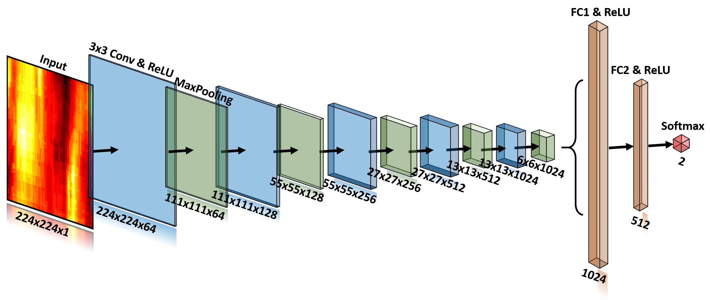

# Deep-learning-models
Deep learning models for cell classification

## Example data
ExampleDataset.rar is the compressed file of ExampleDataset.npz, which contains 30 cell sequences for binary classification. For a cell video, it is represented by the contour sequence and then is zoomed to size of 224x224. Augmentation is performed to generate 216 data subjects from one sequence. Therefore the shape of the example dataset is 30x216x224x224.

## Deep learning frameworks
1. ScratchModel.py trains a CNN model from scratch for cell classification.
  
<b>Figure 1: </b> Scratch model structure.  

2. VggFeatures.py extracts deep features of cell sequence with pre-trained Vgg models. And then SVM and XGboost are performed.

3. VggModel.py fine-tunes pre-trained Vgg models to classify cells.
